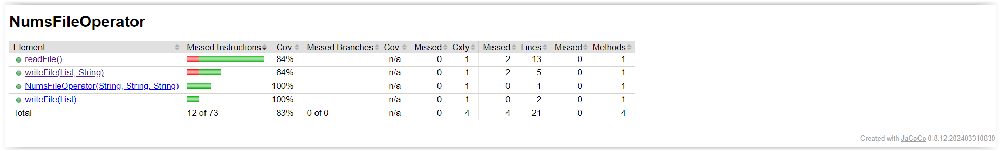

# Converter of various number system

The project involves creating an application that processes data from text files, converting numbers written in various number systems.
## Technologies and libraries used

* Java
* Maven
* Lombok
* JUnit
* AssertJ

## Jacoco Coverage

## Required files

* Users file with pattern:

  sourceCode;targetCode;number in source code type

  for example 2 4 1010

## Description

* Processing data from text files:
  * The text file contains lines in which each line contains: code1 (source number system), code2 (target number system) and the number written in the system specified by code1.

* Number conversion:
  * The application converts a number from the kod1 system to the kod2 system. For example, a number written in binary code (system 2) is converted to quad code (system 4).

* Creating new files:
  * After conversion, the numbers are saved to a new text file.
   * Lines where code1 and code2 are the same (i.e. no conversion is needed) are saved to a separate text file.

Goal: The end result is to obtain two text files:

* One with the converted numbers.
* The second one with numbers that did not require conversion (where code1 equals code2).